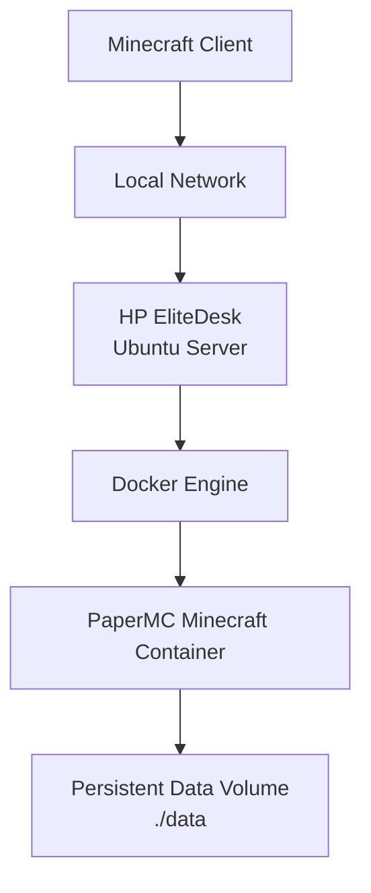
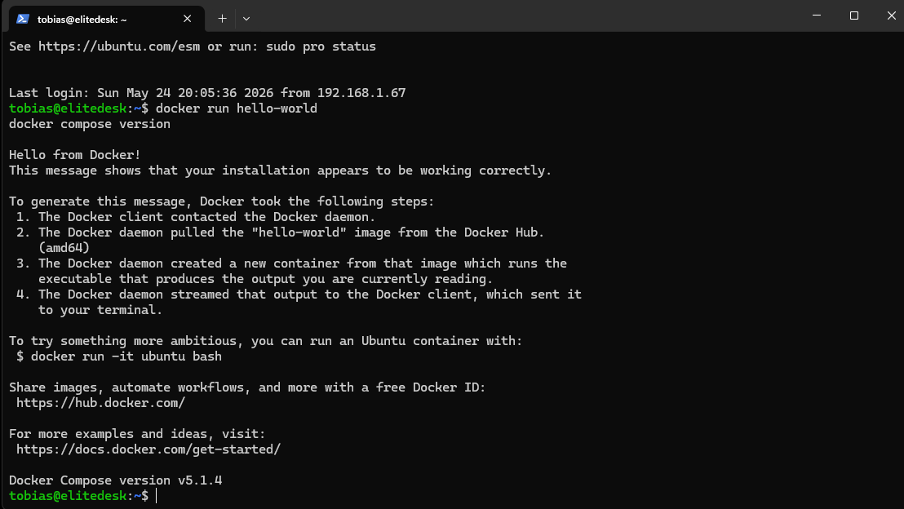
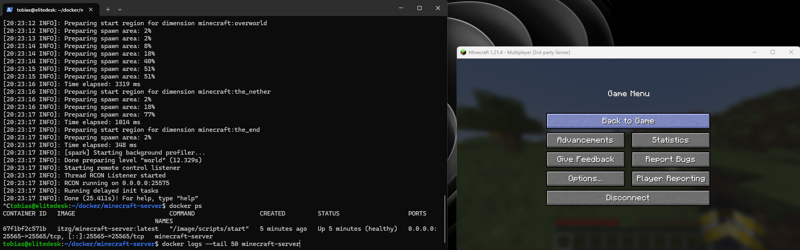
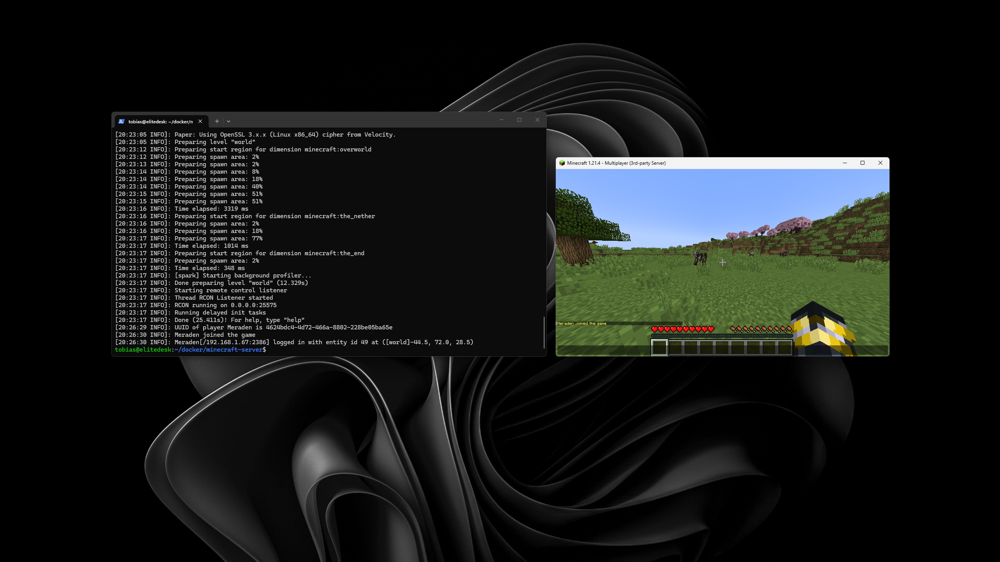
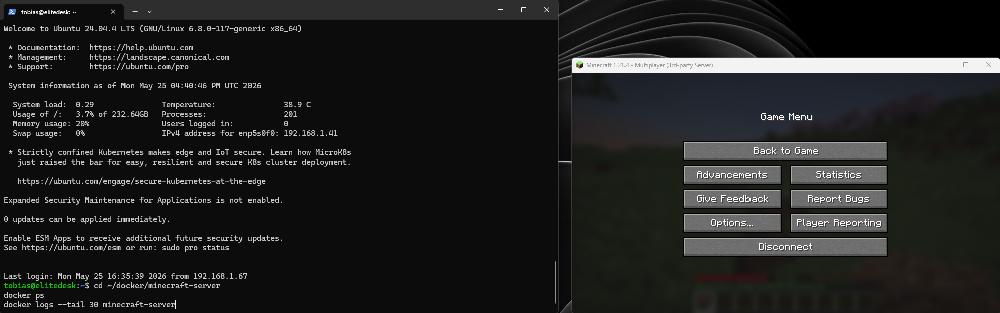
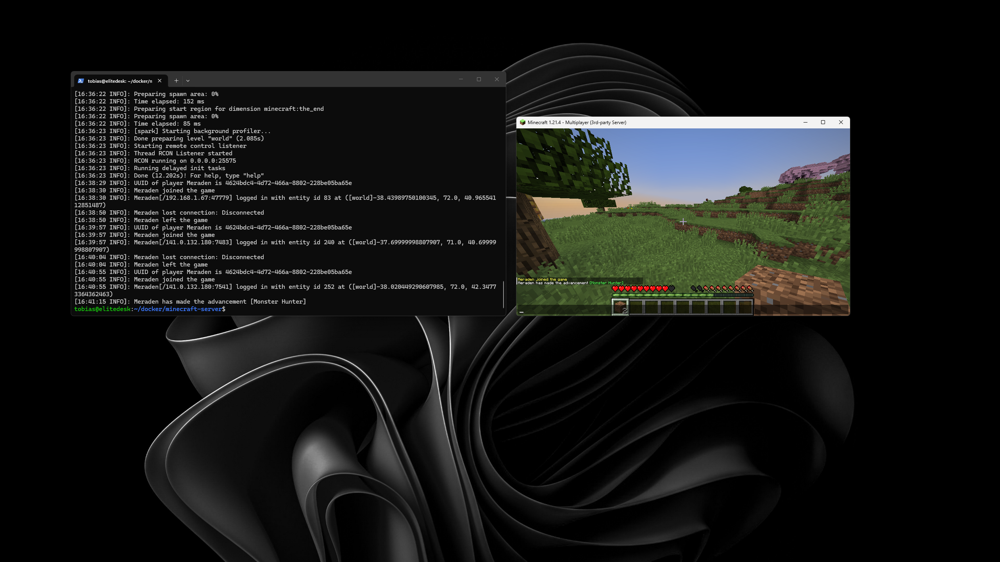
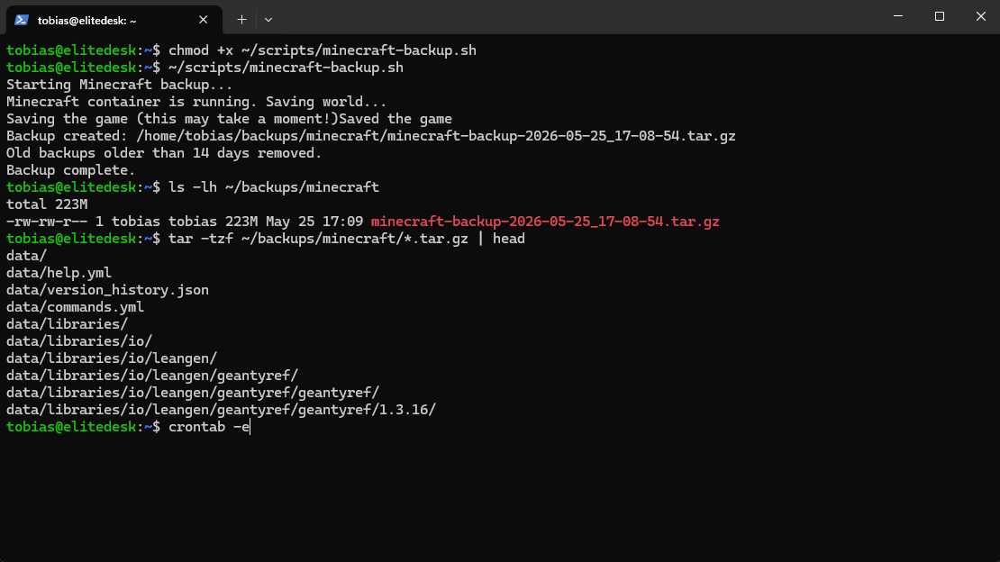

# Docker Minecraft Homelab Server

## Overview

This project documents a Minecraft server running in Docker on a self-hosted Ubuntu Server homelab machine.

The goal of the project is to learn Docker Compose, persistent volumes, container networking, and basic game server operations in a local infrastructure environment.

## Architecture



## Tech Stack

- HP EliteDesk
- Ubuntu Server
- Docker Engine
- Docker Compose
- PaperMC
- Minecraft Java Edition
- Local network access

## Setup Process

- Installed Docker Engine on Ubuntu Server
- Created a Docker Compose configuration
- Deployed a PaperMC Minecraft server container
- Exposed Minecraft port `25565`
- Mounted persistent server data using a local volume
- Configured container restart policy with `unless-stopped`
- Verified the server using Docker logs
- Connected successfully from a Minecraft client on the local network

## Docker Compose Configuration

```yaml
services:
  minecraft:
    image: itzg/minecraft-server:latest
    container_name: minecraft-server
    ports:
      - "25565:25565"
    environment:
      EULA: "TRUE"
      TYPE: "PAPER"
      VERSION: "1.21.4"
      MEMORY: "4G"
      ONLINE_MODE: "TRUE"
      MOTD: "Elitedesk Minecraft Server"
    volumes:
      - ./data:/data
    restart: unless-stopped
```

## Useful Commands

Start the server:

```bash
docker compose up -d
```

View live logs:

```bash
docker logs -f minecraft-server
```

View recent logs:

```bash
docker logs --tail 50 minecraft-server
```

Check running containers:

```bash
docker ps
```

Restart the server:

```bash
docker compose restart
```

Stop the server:

```bash
docker compose down
```

## Current Status

The Minecraft server is running in Docker on the homelab server and is accessible from both the local network and through the configured DNS record:

```text
mc.tobiaslohre.no
```

## Public Access

The Minecraft server was made reachable from outside the local network by configuring router port forwarding and DNS.

- Public DNS record: `mc.tobiaslohre.no`
- Router port forwarding: TCP `25565`
- Internal server IP: `192.168.1.41`
- Minecraft server port: `25565`
- DNS provider: Cloudflare
- Domain registrar: Webhuset

The DNS record points to the public IP address, while the router forwards Minecraft traffic on TCP port `25565` to the internal Ubuntu Server running the Docker container.

## Automated Backups

An automated backup script was created to back up the Minecraft server data directory.

The backup script:

- Saves the Minecraft world before backup using `rcon-cli save-all`
- Creates a compressed `.tar.gz` archive of the persistent `./data` directory
- Stores backups in `~/backups/minecraft`
- Uses timestamps for backup filenames
- Removes backups older than 14 days
- Runs automatically every night using cron

Backup schedule:

```cron
0 4 * * * /home/tobias/scripts/minecraft-backup.sh >> /home/tobias/backups/minecraft/backup.log 2>&1
```

Manual backup command: ~/scripts/minecraft-backup.sh

Example backup output:

Starting Minecraft backup...
Minecraft container is running. Saving world...
Backup created: /home/tobias/backups/minecraft/minecraft-backup-YYYY-MM-DD_HH-MM-SS.tar.gz
Old backups older than 14 days removed.
Backup complete.

Example backup verification: ls -lh ~/backups/minecraft
tar -tzf ~/backups/minecraft/*.tar.gz | head

The backup archive was verified by listing its contents and confirming that it includes the Minecraft server data/ directory.

## Screenshots

The screenshots below show Docker verification, the Docker Compose configuration, the running Minecraft container, successful port testing, and a Minecraft client connection through the configured domain.

### Docker Installation Verified


### Docker Compose Configuration


### Docker Container Running


### Minecraft Client Connected


### Minecraft Domain Port Test


### Minecraft Domain Connection


### Automated Backup Verified


## Key Learnings

- Docker Compose service configuration
- Container port mapping
- Persistent volume usage for server data
- Basic container lifecycle management
- Reading container logs for troubleshooting
- Hosting a service on a self-managed Linux server
- Difference between local network hosting and public internet exposure

## Security Note

The server is publicly reachable through a DNS record and router port forwarding.

Before exposing the server publicly, router port forwarding and firewall rules should be reviewed carefully. Administrative access should remain restricted to SSH on the local network or trusted IP addresses only.

## Next Step

The next phase of this project is to add automated backups and basic monitoring for the Minecraft server.

## Future Improvements

- Add automated backups
- Add monitoring with Prometheus and Grafana
- Add Uptime Kuma for service status monitoring
- Add server hardening and SSH key authentication
