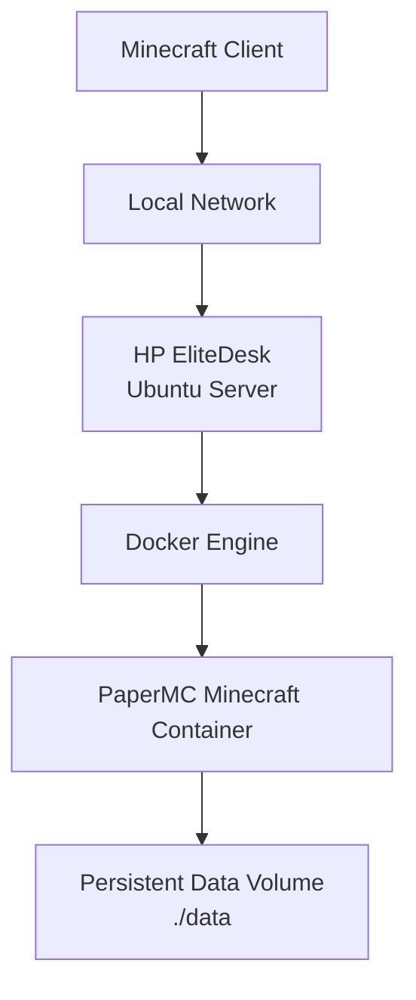

# Docker Minecraft Homelab Server

## Overview

This project documents a Minecraft server running in Docker on a self-hosted Ubuntu Server homelab machine.

The goal of the project is to learn Docker Compose, persistent volumes, container networking, and basic game server operations in a local infrastructure environment.

## Architecture



## Tech Stack

- HP EliteDesk
- Ubuntu Server
- Docker Engine
- Docker Compose
- PaperMC
- Minecraft Java Edition
- Local network access

## Setup Process

- Installed Docker Engine on Ubuntu Server
- Created a Docker Compose configuration
- Deployed a PaperMC Minecraft server container
- Exposed Minecraft port `25565`
- Mounted persistent server data using a local volume
- Configured container restart policy with `unless-stopped`
- Verified the server using Docker logs
- Connected successfully from a Minecraft client on the local network

## Docker Compose Configuration

```yaml
services:
  minecraft:
    image: itzg/minecraft-server:latest
    container_name: minecraft-server
    ports:
      - "25565:25565"
    environment:
      EULA: "TRUE"
      TYPE: "PAPER"
      VERSION: "1.21.4"
      MEMORY: "4G"
      ONLINE_MODE: "TRUE"
      MOTD: "Elitedesk Minecraft Server"
    volumes:
      - ./data:/data
    restart: unless-stopped
```

## Useful Commands

Start the server:

```bash
docker compose up -d
```

View live logs:

```bash
docker logs -f minecraft-server
```

View recent logs:

```bash
docker logs --tail 50 minecraft-server
```

Check running containers:

```bash
docker ps
```

Restart the server:

```bash
docker compose restart
```

Stop the server:

```bash
docker compose down
```

## Current Status

The Minecraft server is running in Docker on the homelab server and is accessible from the local network.

Local server address:

```text
192.168.1.41:25565
```

## Screenshots

The screenshots below show the Docker Compose configuration, the running Minecraft container, and a successful Minecraft client connection on the local network.

### Docker Installation Verified


### Docker Compose Configuration


### Docker Container Running


### Minecraft Client Connected


## Key Learnings

- Docker Compose service configuration
- Container port mapping
- Persistent volume usage for server data
- Basic container lifecycle management
- Reading container logs for troubleshooting
- Hosting a service on a self-managed Linux server
- Difference between local network hosting and public internet exposure

## Security Note

The server is currently tested on the local network only.

Before exposing the server publicly, router port forwarding and firewall rules should be reviewed carefully. Administrative access should remain restricted to SSH on the local network or trusted IP addresses only.

## Next Step

The next phase of this project is to make the server publicly reachable using router port forwarding and a custom domain managed through Cloudflare DNS.

## Future Improvements

- Add automated backups
- Add monitoring with Prometheus and Grafana
- Add Uptime Kuma for service status monitoring
- Add server hardening and SSH key authentication
