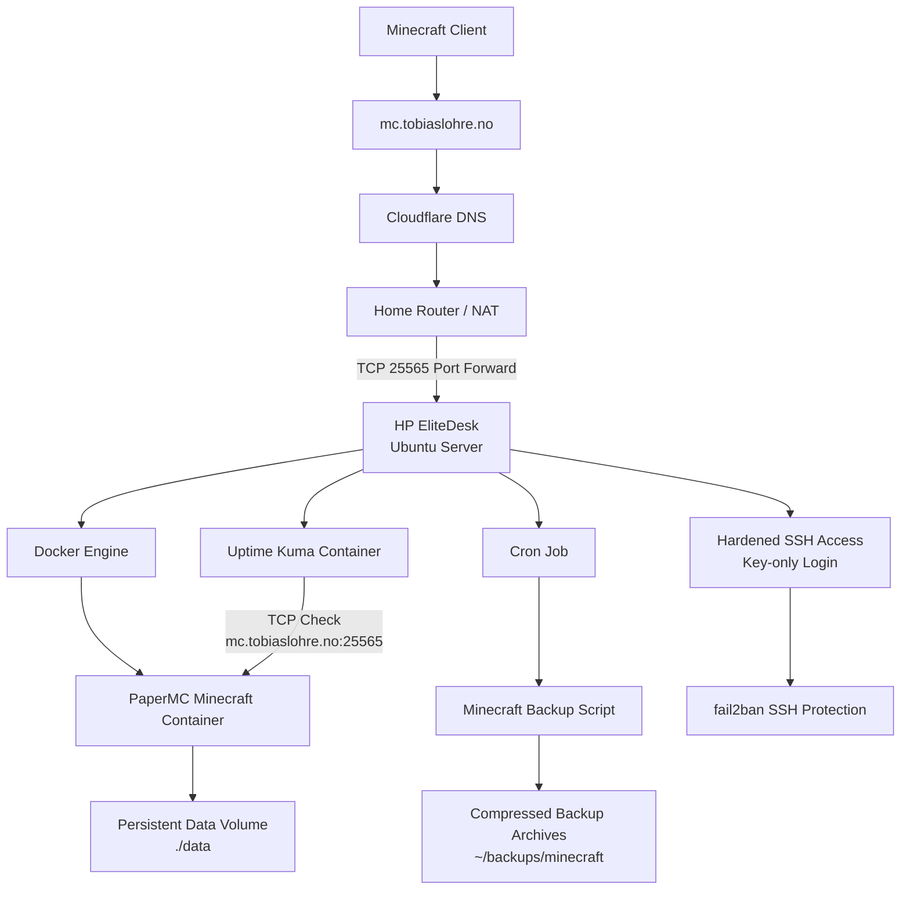
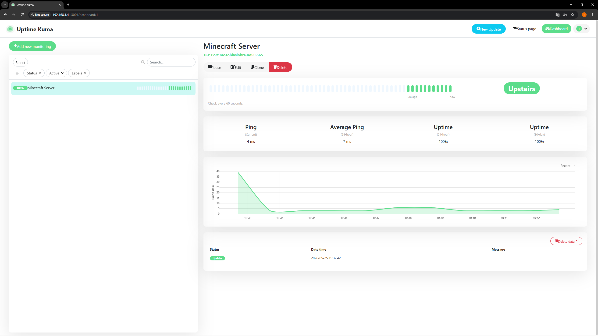
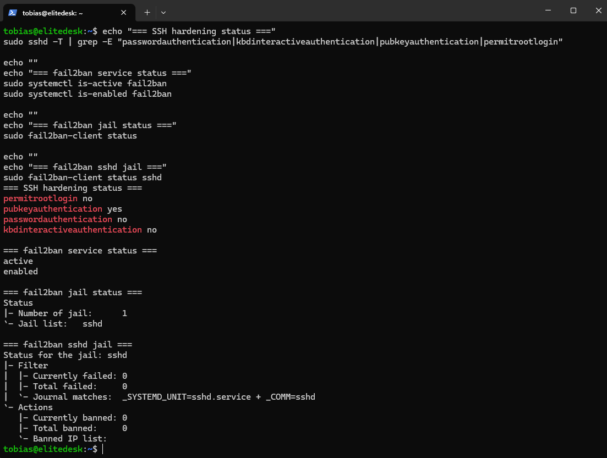

# Docker Minecraft Homelab Server

## Overview

This project documents a Minecraft server running in Docker on a self-hosted Ubuntu Server homelab machine.

The goal of the project is to learn Docker Compose, persistent volumes, container networking, and basic game server operations in a local infrastructure environment.

## Architecture

## Architecture



## Tech Stack

- HP EliteDesk
- Ubuntu Server
- Docker Engine
- Docker Compose
- PaperMC
- Minecraft Java Edition
- Local network access

## Setup Process

- Installed Docker Engine on Ubuntu Server
- Created a Docker Compose configuration
- Deployed a PaperMC Minecraft server container
- Exposed Minecraft port `25565`
- Mounted persistent server data using a local volume
- Configured container restart policy with `unless-stopped`
- Verified the server using Docker logs
- Connected successfully from a Minecraft client on the local network

## Docker Compose Configuration

```yaml
services:
  minecraft:
    image: itzg/minecraft-server:latest
    container_name: minecraft-server
    ports:
      - "25565:25565"
    environment:
      EULA: "TRUE"
      TYPE: "PAPER"
      VERSION: "1.21.4"
      MEMORY: "4G"
      ONLINE_MODE: "TRUE"
      MOTD: "Elitedesk Minecraft Server"
    volumes:
      - ./data:/data
    restart: unless-stopped
```

## Useful Commands

Start the server:

```bash
docker compose up -d
```

View live logs:

```bash
docker logs -f minecraft-server
```

View recent logs:

```bash
docker logs --tail 50 minecraft-server
```

Check running containers:

```bash
docker ps
```

Restart the server:

```bash
docker compose restart
```

Stop the server:

```bash
docker compose down
```

## Current Status

The Minecraft server is running in Docker on the homelab server and is accessible from both the local network and through the configured DNS record:

```text
mc.tobiaslohre.no
```

## Public Access

The Minecraft server was made reachable from outside the local network by configuring router port forwarding and DNS.

- Public DNS record: `mc.tobiaslohre.no`
- Router port forwarding: TCP `25565`
- Internal server IP: `192.168.1.41`
- Minecraft server port: `25565`
- DNS provider: Cloudflare
- Domain registrar: Webhuset

The DNS record points to the public IP address, while the router forwards Minecraft traffic on TCP port `25565` to the internal Ubuntu Server running the Docker container.

## Automated Backups

An automated backup script was created to back up the Minecraft server data directory.

The backup script:

- Saves the Minecraft world before backup using `rcon-cli save-all`
- Creates a compressed `.tar.gz` archive of the persistent `./data` directory
- Stores backups in `~/backups/minecraft`
- Uses timestamps for backup filenames
- Removes backups older than 14 days
- Runs automatically every night using cron

Backup schedule:

```cron
0 4 * * * /home/tobias/scripts/minecraft-backup.sh >> /home/tobias/backups/minecraft/backup.log 2>&1
```

Manual backup command: ~/scripts/minecraft-backup.sh

Example backup output:

Starting Minecraft backup...
Minecraft container is running. Saving world...
Backup created: /home/tobias/backups/minecraft/minecraft-backup-YYYY-MM-DD_HH-MM-SS.tar.gz
Old backups older than 14 days removed.
Backup complete.

Example backup verification: ls -lh ~/backups/minecraft
tar -tzf ~/backups/minecraft/*.tar.gz | head

The backup archive was verified by listing its contents and confirming that it includes the Minecraft server data/ directory.

## Restore Test

A restore test was performed by extracting the latest backup archive into a separate test directory without overwriting the live Minecraft server data.

The restore test verified that:

- The backup archive could be extracted successfully
- The restored `data/` directory was present
- Minecraft world directories were included:
  - `world`
  - `world_nether`
  - `world_the_end`
- The restored data size matched the live server data size

Restore test commands:

```bash
mkdir -p ~/restore-test/minecraft

LATEST_BACKUP=$(ls -t ~/backups/minecraft/minecraft-backup-*.tar.gz | head -1)
echo "$LATEST_BACKUP"

tar -xzf "$LATEST_BACKUP" -C ~/restore-test/minecraft

ls -lh ~/restore-test/minecraft
ls -lh ~/restore-test/minecraft/data

du -sh ~/docker/minecraft-server/data
du -sh ~/restore-test/minecraft/data

rm -rf ~/restore-test
```

Oppdater også `Key Learnings` med disse punktene:

```md
- Automated backup scripting
- Cron-based scheduled tasks
- Backup retention management
- Restore testing and backup verification
```
## Monitoring

Uptime Kuma was deployed using Docker Compose to monitor the public Minecraft server endpoint.

The monitor checks whether the Minecraft server is reachable on the configured TCP port.

Monitored endpoint:

```text
mc.tobiaslohre.no:25565
```
Monitoring setup:

Uptime Kuma runs in Docker
Web interface is available locally on port 3001
Minecraft server is monitored using a TCP port check
Uptime Kuma access is restricted to the local network through UFW

UFW rule for local-only access:

sudo ufw allow from 192.168.1.0/24 to any port 3001 proto tcp

## Server Hardening

Basic server hardening was applied to reduce the attack surface of the homelab server.

Implemented hardening steps:

- SSH key authentication enabled
- Password-based SSH login disabled
- Root SSH login disabled
- Keyboard-interactive authentication disabled
- SSH configuration validated using `sshd -t`
- SSH access tested using public key authentication
- fail2ban installed and enabled for SSH protection

Effective SSH configuration:

```text

fail2ban status:

Number of jail: 1
Jail list: sshd
Currently banned: 0

This improves SSH security by allowing only public key authentication and monitoring failed SSH login attempts.
pubkeyauthentication yes
passwordauthentication no
kbdinteractiveauthentication no
permitrootlogin no
```
This improves SSH security by allowing only public key authentication and monitoring failed SSH login attempts.

## Screenshots

The screenshots below show Docker verification, the Docker Compose configuration, the running Minecraft container, successful port testing, and a Minecraft client connection through the configured domain.

### Docker Installation Verified


### Docker Compose Configuration


### Docker Container Running


### Minecraft Client Connected


### Minecraft Domain Port Test


### Minecraft Domain Connection


### Automated Backup Verified


### Uptime Kuma Monitoring


### Server Hardening Verified


## Key Learnings

- Docker Compose service configuration
- Container port mapping
- Persistent volume usage for server data
- Basic container lifecycle management
- Reading container logs for troubleshooting
- Hosting a service on a self-managed Linux server
- Difference between local network hosting and public internet exposure
- Basic service monitoring with Uptime Kuma
- TCP port monitoring for public services
- Restricting internal admin dashboards to the local network

## Security Note

The server is publicly reachable through a DNS record and router port forwarding.

SSH access has been hardened by enabling public key authentication, disabling password-based login, disabling root login, and enabling fail2ban for SSH protection.

Only the required Minecraft port is exposed publicly. Administrative access should remain restricted to the local network or trusted IP addresses.

## Future Improvements

## Future Improvements

- Add off-server backups
- Add Prometheus and Grafana monitoring
- Add alert notifications for service downtime
- Automate deployment with Ansible
